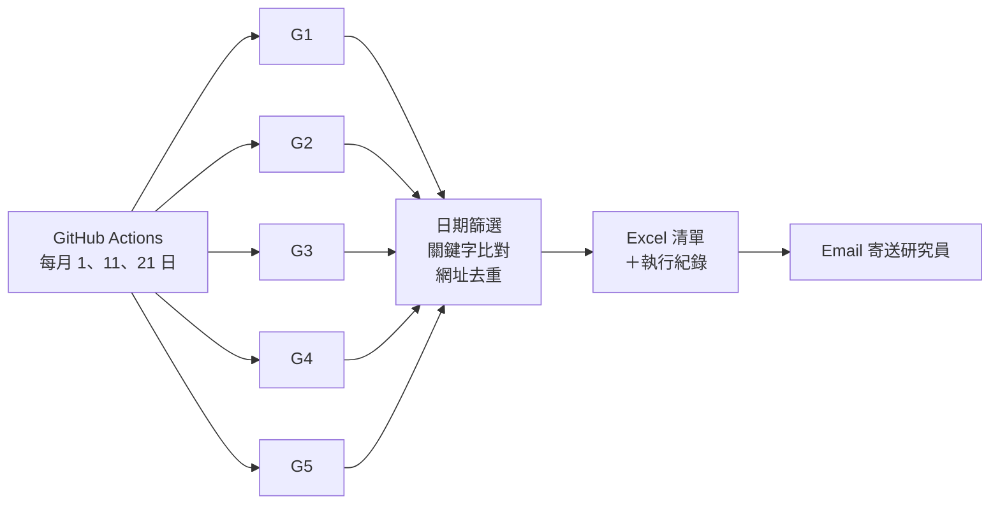

[README.md](https://github.com/user-attachments/files/32997940/README.md)
# 國際智庫涉中報導自動彙整系統

自動追蹤 35 個國際智庫發表的中國、台灣相關研究，每月三次將新文章整理成 Excel 清單並寄送給研究人員。

本專案為本人於中華經濟研究院 中國經濟研究所擔任計畫助理期間開發。

## 背景

研究人員需要持續掌握各國智庫對中國與台灣議題的最新研究。原本的做法是人工逐一瀏覽各智庫網站、比對發布日期，耗時且容易遺漏。本系統將這個流程自動化，研究人員只需收信即可取得當期整理好的清單。

## 運作流程

1. **Extract**：GitHub Actions 依排程啟動 5 個平行作業，依各網站特性使用瀏覽器自動化（Selenium、Playwright）、直接呼叫網站搜尋 API，或下載 PDF 解析全文。
2. **Transform**：只保留發布日期落在本期區間內、且內文提及 `China`、`Taiwan` 或 `Taipei` 的文章，並以網址去除重複。
3. **Load**：整理成 Excel（機構、日期、標題、網址、關鍵字），連同執行紀錄寄給研究人員。

## 資料區間

| 執行日 | 抓取區間 |
|---|---|
| 每月 1 日 | 上月 21 日 ～ 上月底 |
| 每月 11 日 | 本月 1 日 ～ 10 日 |
| 每月 21 日 | 本月 11 日 ～ 20 日 |

非排程日手動執行時，預設抓取最近 10 天。

## 資料來源

| 檔案 | 來源 |
|---|---|
| `G1_normal.py` | Atlantic Council、Atlantic Council Global China Hub、RUSI、MERICS、RAND、JISS |
| `G2_normal.py` | KIEP、DIIS、IAI、NUPI、ORF、IFANS、ISPI |
| `G3_normal.py` | Egmont Institute、PIIE、CNAS、EAI、LSE IDEAS、EPC |
| `G4_normal.py` | Gateway House、JIIA、Lowy Institute、ECIPE、DGAP、Elcano、KAS、SWP |
| `G5_normal.py` | IFRI、ECFR、IDS、IISS、EVC、Sinopsis、ERIA、JETRO |

## 設計重點

- **錯誤隔離**：每個來源各自處理例外，單一網站改版或連線失敗不會中斷整批作業。
- **自動停止**：連續多篇文章早於起始日期即停止翻頁，並設有翻頁上限，避免執行時間失控。
- **可追溯**：完整執行紀錄隨信寄出，每次執行狀態也保留在 GitHub Actions，便於定位問題來源。

## 使用技術

Python、Selenium、Playwright、pdfplumber、pandas、GitHub Actions

## 部署方式

在 repo 的 **Settings → Secrets and variables → Actions** 設定以下三個 Secrets：

| 名稱 | 說明 |
|---|---|
| `EMAIL_SENDER` | 寄件 Gmail 帳號 |
| `EMAIL_PASSWORD` | Gmail 應用程式密碼 |
| `EMAIL_RECIPIENT` | 收件人信箱 |

設定完成後，workflow 會依排程自動執行，也可在 **Actions** 分頁手動觸發。排程時間統一使用台灣時區（`TZ: Asia/Taipei`）。
